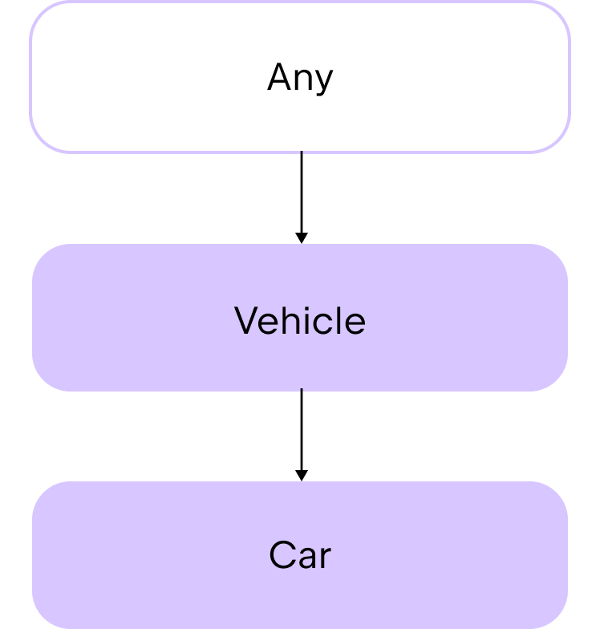

[//]: # (title: Classes and interfaces)

<no-index/>


初心者向けツアーでは、クラスやデータクラスを使用してデータを格納し、コード内で共有できる一連の特性を管理する方法を学びました。
最終的には、プロジェクト内でコードを効率的に共有するために、階層構造を構築したくなるでしょう。
この章では、Kotlinが提供するコード共有の機能と、それらがどのようにしてコードの安全性と保守性を高めるかについて解説します。

## Class inheritance
## クラスの継承

前の章では、元のソースコードを変更せずに、拡張関数を使ってクラスを拡張する方法について解説しました。
しかし、クラス**間で**コードを共有した方が便利なような複雑なプロジェクトに取り組んでいる場合はどうでしょうか？
そのような場合は、クラスの継承を利用することができます。

デフォルトでは、Kotlinのクラスは継承できません。
Kotlinは、意図しない継承を防ぎ、クラスの保守性を高めるために、このように設計されています。

Kotlinのクラスは**単一継承**のみをサポートしており、つまり**一度に1つのクラス**からのみ継承することができます。
このクラスは **親** と呼ばれます。

あるクラスの親クラスは、別のクラス（祖父母クラス）から継承され、階層構造を形成します。
Kotlinのクラス階層の最上位には、共通の親クラスである `Any` があります。
すべてのクラスは、最終的には `Any` クラスを継承しています：

<!-- コメントアウト記号 -->
<!-- {width=「200」} -->

<div align="center">
      
</div>

`Any` クラスは、`toString()` 関数をメンバー関数として自動的に提供します。したがって、この継承された関数は、どのクラスでも使用できます。例えば：

```kotlin
class Car(val make: String, val model: String, val numberOfDoors: Int)

fun main() {
    //sampleStart
    val car1 = Car("Toyota", "Corolla", 4)

    // 文字列テンプレートを介して .toString() 関数を使用し、クラスのプロパティを出力します
    println("Car1: make=${car1.make}, model=${car1.model}, numberOfDoors=${car1.numberOfDoors}")    // Car1: make=Toyota, model=Corolla, numberOfDoors=4
    //sampleEnd
}
```
{kotlin-runnable="true" id="kotlin-tour-any-class"}

継承を利用してクラス間でコードを共有したい場合は、まず抽象クラスの使用を検討してください。

### Abstract classes
### 抽象クラス

抽象クラスは、デフォルトで継承可能です。抽象クラスの目的は、他のクラスが継承または実装するメンバを提供することです。
その結果、コンストラクタは存在しますが、それらからインスタンスを作成することはできません。
子クラス内では、`override` キーワードを使用して、親クラスのプロパティや関数の挙動を定義します。
このように、子クラスは親クラスのメンバを「上書きする」と言えるでしょう。

> 継承された関数やプロパティの挙動を定義することを、**実装**と呼びます。
> 
{style="tip"}

抽象クラスには、実装が**ある**関数やプロパティと、実装が**ない**関数やプロパティ（これらは抽象関数および抽象プロパティと呼ばれる）の両方を含めることができます。

抽象クラスを作成するには、`abstract` キーワードを使用します：

```kotlin
abstract class Animal
```

実装を**伴わない**関数やプロパティを宣言するには、`abstract` キーワードを使用します：

```kotlin
abstract fun makeSound()
abstract val sound: String
```

たとえば、`Product` という抽象クラスを作成し、そこから派生クラスを作成してさまざまな商品カテゴリを定義したい場合を考えてみましょう：

```kotlin
abstract class Product(val name: String, var price: Double) {
    // 商品カテゴリの抽象プロパティ
    abstract val category: String

    // すべての製品で共有できる関数
    fun productInfo(): String {
        return "Product: $name, Category: $category, Price: $price"
    }
}
```

抽象クラスでは：

* コンストラクタには、製品の `name` と `price` を指定するための 2 つのパラメータがあります。
* 製品カテゴリを文字列として格納する抽象プロパティがあります。
* 製品に関する情報を表示する機能があります。

エレクトロニクス用の派生クラス`Electronic`を作成しましょう。
子クラスで `category` プロパティの実装を定義する前に、`override` キーワードを使用する必要があります：

```kotlin
class Electronic(name: String, price: Double, val warranty: Int) : Product(name, price) {
    override val category = "Electronic"
}
```

`Electronic` クラス：

* `Product` 抽象クラスを継承しています。
* コンストラクタに、電子機器特有の追加パラメータ `warranty` が用意されています。
* `category` プロパティを上書きし、文字列 `「Electronic」` を設定します。

さて、これらのクラスは次のように使用できます：

```kotlin
abstract class Product(val name: String, var price: Double) {
    // 商品カテゴリの抽象プロパティ
    abstract val category: String

    // すべての製品で共有できる関数
    fun productInfo(): String {
        return "Product: $name, Category: $category, Price: $price"
    }
}

class Electronic(name: String, price: Double, val warranty: Int) : Product(name, price) {
    override val category = "Electronic"
}

//sampleStart
fun main() {
    // Electronicクラスのインスタンスを作成します
    val laptop = Electronic(name = "Laptop", price = 1000.0, warranty = 2)

    println(laptop.productInfo())   // Product: Laptop, Category: Electronic, Price: 1000.0
}
//sampleEnd
```
{kotlin-runnable="true" id="kotlin-tour-abstract-class"}

抽象クラスはこのような形でコードを共有するのに非常に便利ですが、Kotlinのクラスは単一継承しかサポートしていないため、その活用には制限があります。
複数のソースから継承する必要がある場合は、インターフェースの使用を検討してください。

## Interfaces
## インターフェース

インターフェースはクラスと似ていますが、いくつかの違いがあります：

* インターフェースのインスタンスを作成することはできません。
それらはコンストラクタもヘッダーもありません。
* それらの関数やプロパティは、デフォルトで暗黙的に継承可能です。Kotlinでは、これらは「オープン」であると言います。
* 関数に実装を定義しない場合は、その関数を `abstract` としてマークする必要はありません。

抽象クラスと同様に、インターフェースを使用することで、クラスが後で継承・実装できる一連の関数やプロパティを定義します。
このアプローチにより、具体的な実装の詳細ではなく、インターフェースによって定義される抽象概念に焦点を当てることができます。
インターフェースを使用すると、コードは次のような特徴を持つようになります：

* 各部分を分離し、それぞれが独立して進化できるようにするため、よりモジュール化が進んでいる。
* 関連する関数をまとまりのあるグループにまとめることで、理解しやすくなる。
* テストが容易になります。テストの際、実装をモックと素早く置き換えることができるからです。

インターフェースを宣言するには、`interface` キーワードを使用します：

```kotlin
interface PaymentMethod
```

### Interface implementation
### インターフェースの実装

インターフェースは多重継承をサポートしているため、クラスは一度に複数のインターフェースを実装することができます。
まず、クラスが**1つ**のインターフェースを実装しているケースについて考えてみましょう。

インターフェースを実装するクラスを作成するには、クラスヘッダーの後にコロンを付け、その後に実装したいインターフェース名を記述します。
インターフェースにはコンストラクタがないため、インターフェース名の後に括弧 `()` は付けません：

```kotlin
class CreditCardPayment : PaymentMethod
```

For example:

```kotlin
interface PaymentMethod {
    // 関数はデフォルトで継承可能です
    fun initiatePayment(amount: Double): String
}

class CreditCardPayment(val cardNumber: String, val cardHolderName: String, val expiryDate: String) : PaymentMethod {
    override fun initiatePayment(amount: Double): String {
        // クレジットカードによる支払いの処理をシミュレートする
        return "Payment of $$amount initiated using Credit Card ending in ${cardNumber.takeLast(4)}."
    }
}

fun main() {
    val paymentMethod = CreditCardPayment("1234 5678 9012 3456", "John Doe", "12/25")
    println(paymentMethod.initiatePayment(100.0))
    // 末尾が3456のクレジットカードを使用して、100.0ドルの支払いが開始されました。
}
```
{kotlin-runnable="true" id="kotlin-tour-interface-inheritance"}

この例では：

* `PaymentMethod` は、実装のない `initiatePayment()` 関数を持つインターフェースです。
* `CreditCardPayment` は、`PaymentMethod` インターフェースを実装するクラスです。
* `CreditCardPayment` クラスは、継承された `initiatePayment()` 関数をオーバーライドしています。
* `paymentMethod` は `CreditCardPayment` クラスのインスタンスです。
* オーバーライドされた `initiatePayment()` 関数は、`paymentMethod` インスタンスに対して、パラメータ `100.0` を引数として呼び出されます。

**複数の**インターフェースを実装するクラスを作成するには、クラスヘッダーの後にコロンを付け、その後に実装したいインターフェース名をコンマで区切って記述します。

```kotlin
class CreditCardPayment : PaymentMethod, PaymentType
```

例えば：

```kotlin
interface PaymentMethod {
    fun initiatePayment(amount: Double): String
}

interface PaymentType {
    val paymentType: String
}

class CreditCardPayment(val cardNumber: String, val cardHolderName: String, val expiryDate: String) : PaymentMethod, PaymentType {
    override fun initiatePayment(amount: Double): String {
        // Simulate processing payment with credit card
        return "Payment of $$amount initiated using Credit Card ending in ${cardNumber.takeLast(4)}."
    }

    override val paymentType: String = "Credit Card"
}

fun main() {
    val paymentMethod = CreditCardPayment("1234 5678 9012 3456", "John Doe", "12/25")
    println(paymentMethod.initiatePayment(100.0))
    // 末尾が3456のクレジットカードを使用して、100.0ドルの支払いが開始されました。

    println("Payment is by ${paymentMethod.paymentType}")
    // お支払いはクレジットカードでお願いいたします
}
```
{kotlin-runnable="true" id="kotlin-tour-interface-multiple-inheritance"}

この例では：

* `PaymentMethod` は、実装のない `initiatePayment()` 関数を持つインターフェースです。
* `PaymentType` は、初期化されていない `paymentType` プロパティを持つインターフェースです。
* `CreditCardPayment` は、`PaymentMethod` および `PaymentType` インターフェースを実装するクラスです。
* `CreditCardPayment` クラスは、継承された `initiatePayment()` 関数と `paymentType` プロパティをオーバーライドしています。
* `paymentMethod` は `CreditCardPayment` クラスのインスタンスです。
* オーバーライドされた `initiatePayment()` 関数は、`paymentMethod` インスタンスに対して、パラメータ `100.0` を引数として呼び出されます。
* オーバーライドされた `paymentType` プロパティは、`paymentMethod` インスタンス上で参照されます。

インターフェースおよびインターフェースの継承に関する詳細については、[インターフェース](interfaces.md)を参照してください。

## Delegation
## 委譲

インターフェースは便利ですが、インターフェースに多くの関数が含まれていると、その子クラスには大量の定型コードが含まれてしまう可能性があります。
クラスの動作のごく一部だけを上書きしたい場合、同じコードを何度も繰り返さなければなりません。

> ボイラープレートコードとは、ソフトウェアプロジェクトの複数の箇所で、ほとんど、あるいはまったく変更を加えることなく再利用されるコードの塊のことです。
> 
{style="tip"}

たとえば、`DrawingTool` という名前のインターフェースがあり、そこにいくつかの関数と `color` というプロパティが1つ含まれているとします：

```kotlin
interface DrawingTool {
    val color: String
    fun draw(shape: String)
    fun erase(area: String)
    fun getToolInfo(): String
}
```

`PenTool` というクラスを作成します。このクラスは `DrawingTool` インターフェースを実装し、そのすべてのメンバに対する実装を提供します：

```kotlin
class PenTool : DrawingTool {
    override val color: String = "black"

    override fun draw(shape: String) {
        println("Drawing $shape using a pen in $color")
    }

    override fun erase(area: String) {
        println("Erasing $area with pen tool")
    }

    override fun getToolInfo(): String {
        return "PenTool(color=$color)"
    }
}
```

`PenTool` と同じ動作をするが、`color` の値が異なるクラスを作成したいのです。
一つの方法は、`DrawingTool` インターフェースを実装するオブジェクトをパラメータとして受け取る新しいクラスを作成することです。
たとえば、`PenTool` クラスのインスタンスのように。そうすれば、そのクラス内で `color` プロパティをオーバーライドすることができます。

しかし、このシナリオでは、`DrawingTool` インターフェースの各メンバーに対して実装を追加する必要があります：

```kotlin
interface DrawingTool {
    val color: String
    fun draw(shape: String)
    fun erase(area: String)
    fun getToolInfo(): String
}

class PenTool : DrawingTool {
    override val color: String = "black"

    override fun draw(shape: String) {
        println("Drawing $shape using a pen in $color")
    }

    override fun erase(area: String) {
        println("Erasing $area with pen tool")
    }

    override fun getToolInfo(): String {
        return "PenTool(color=$color)"
    }
}
//sampleStart
class CanvasSession(val tool: DrawingTool) : DrawingTool {
    override val color: String = "blue"

    override fun draw(shape: String) {
        tool.draw(shape)
    }

    override fun erase(area: String) {
        tool.erase(area)
    }

    override fun getToolInfo(): String {
        return tool.getToolInfo()
    }
}
//sampleEnd
fun main() {
    val pen = PenTool()
    val session = CanvasSession(pen)

    println("Pen color: ${pen.color}")
    // Pen color: black

    println("Session color: ${session.color}")
    // Session color: blue

    session.draw("circle")
    // Drawing circle with pen in black

    session.erase("top-left corner")
    // Erasing top-left corner with pen tool

    println(session.getToolInfo())
    // PenTool(color=black)
}
```
{kotlin-runnable="true" id="kotlin-tour-interface-non-delegation"}

`DrawingTool` インターフェースに多数のメンバ関数があると、`CanvasSession` クラス内の定型コードの量が多くなってしまうことがわかります。
しかし、別の方法もあります。

Kotlin では、`by` キーワードを使用して、インターフェースの実装をクラスのインスタンスに委譲することができます。
例えば：

```kotlin
class CanvasSession(val tool: DrawingTool) : DrawingTool by tool
```

ここで、`tool` は、メンバ関数の実装が委譲される `PenTool` クラスのインスタンスの名前です。

これで、`CanvasSession` クラスのメンバ関数に対して実装を追加する必要はなくなりました。
コンパイラが `PenTool` クラスから自動的にこれを行ってくれます。
これにより、大量の定型コードを書く手間が省けます。
その代わりに、子クラスで変更したい動作についてのみコードを追加します。

たとえば、`color` プロパティの値を変更したい場合は：

```kotlin
interface DrawingTool {
    val color: String
    fun draw(shape: String)
    fun erase(area: String)
    fun getToolInfo(): String
}

class PenTool : DrawingTool {
    override val color: String = "black"

    override fun draw(shape: String) {
        println("Drawing $shape using a pen in $color")
    }

    override fun erase(area: String) {
        println("Erasing $area with pen tool")
    }

    override fun getToolInfo(): String {
        return "PenTool(color=$color)"
    }
}

//sampleStart
class CanvasSession(val tool: DrawingTool) : DrawingTool by tool {
    // 定型コードは不要！
    override val color: String = "blue"
}
//sampleEnd
fun main() {
    val pen = PenTool()
    val session = CanvasSession(pen)

    println("Pen color: ${pen.color}")
    // Pen color: black

    println("Session color: ${session.color}")
    // Session color: blue

    session.draw("circle")
    // Drawing circle with pen in black

    session.erase("top-left corner")
    // Erasing top-left corner with pen tool

    println(session.getToolInfo())
    // PenTool(color=black)
}
```
{kotlin-runnable="true" id="kotlin-tour-interface-delegation"}

必要であれば、`CanvasSession` クラスから継承されたメンバ関数の動作を上書きすることもできますが、これで、継承されたメンバ関数ごとに新しいコード行を追加する必要はなくなりました。

詳細については、[委譲(delegation)](delegation.md)を参照してください。

## 演習 {completion-point="true"}

### 課題 1 {initial-collapse-state="collapsed" collapsible="true" id="classes-interfaces-exercise-1"}

スマートホームシステムの開発に取り組んでいると想像してみてください。
スマートホームには通常、さまざまな種類のデバイスが導入されており、それらはすべて基本的な機能を備えている一方で、それぞれ独自の動作特性も持っています。
以下のコードサンプルで、子クラス `SmartLight` が正常にコンパイルされるように、`SmartDevice` という名前の `abstract` クラスを完成させてください。

次に、`SmartDevice` クラスを継承し、どのサーモスタットが暖房中か、あるいはオフになっているかを説明する print 文を返す `turnOn()` および `turnOff()` 関数を実装した、`SmartThermostat` という名前の子クラスをもう1つ作成してください。
最後に、温度の測定値を入力として受け取り、`$name サーモスタットが $temperature°C に設定されました。`と出力する `adjustTemperature()` という関数を追加してください。

<deflist collapsible="true">
    <def title="Hint">
        <code>SmartDevice</code> クラスに、<code>turnOn()</code> および <code>turnOff()</code> 関数を追加してください。これにより、後で <code>SmartThermostat</code> クラスでこれらの動作をオーバーライドできるようになります。
    </def>
</deflist>

|--|--|

```kotlin
abstract class // ここにコードを入力してください

class SmartLight(name: String) : SmartDevice(name) {
    override fun turnOn() {
        println("$name is now ON.")
    }

    override fun turnOff() {
        println("$name is now OFF.")
    }

   fun adjustBrightness(level: Int) {
        println("Adjusting $name brightness to $level%.")
    }
}

class SmartThermostat // ここにコードを入力してください

fun main() {
    val livingRoomLight = SmartLight("Living Room Light")
    val bedroomThermostat = SmartThermostat("Bedroom Thermostat")
    
    livingRoomLight.turnOn()
    // リビングの照明が点灯しました。
    livingRoomLight.adjustBrightness(10)
    // リビングの照明の明るさを10%に調整します。
    livingRoomLight.turnOff()
    // リビングの照明は現在消えています。

    bedroomThermostat.turnOn()
    // 寝室のサーモスタットが現在、暖房運転中です。
    bedroomThermostat.adjustTemperature(5)
    // 寝室のサーモスタットは5°Cに設定されています。
    bedroomThermostat.turnOff()
    // 寝室のサーモスタットは現在オフになっています。
}
```
{validate="false" kotlin-runnable="true" kotlin-min-compiler-version="1.3" id="kotlin-tour-classes-interfaces-exercise-1"}

|---|---|
```kotlin
abstract class SmartDevice(val name: String) {
    abstract fun turnOn()
    abstract fun turnOff()
}

class SmartLight(name: String) : SmartDevice(name) {
    override fun turnOn() {
        println("$name is now ON.")
    }

    override fun turnOff() {
        println("$name is now OFF.")
    }

   fun adjustBrightness(level: Int) {
        println("Adjusting $name brightness to $level%.")
    }
}

class SmartThermostat(name: String) : SmartDevice(name) {
    override fun turnOn() {
        println("$name thermostat is now heating.")
    }

    override fun turnOff() {
        println("$name thermostat is now off.")
    }

   fun adjustTemperature(temperature: Int) {
        println("$name thermostat set to $temperature°C.")
    }
}


fun main() {
    val livingRoomLight = SmartLight("Living Room Light")
    val bedroomThermostat = SmartThermostat("Bedroom Thermostat")
    
    livingRoomLight.turnOn()
    // リビングの照明が点灯しました。
    livingRoomLight.adjustBrightness(10)
    // リビングの照明の明るさを10%に調整します。
    livingRoomLight.turnOff()
    // リビングの照明は現在オフになっています。

    bedroomThermostat.turnOn()
    // 寝室のサーモスタットは現在、暖房運転中です。
    bedroomThermostat.adjustTemperature(5)
    // 寝室のサーモスタットを5°Cに設定しました。
    bedroomThermostat.turnOff()
    // 寝室のサーモスタットは現在オフになっています。
}
```
{initial-collapse-state="collapsed" collapsible="true" collapsed-title="Example solution" id="kotlin-tour-classes-interfaces-solution-1"}

### 課題 2 {initial-collapse-state="collapsed" collapsible="true" id="classes-interfaces-exercise-2"}

`Audio`、`Video`、`Podcast` などの特定のメディアクラスを実装するために使用できる `Media` というインターフェースを作成してください。このインターフェースには、以下の要素を含める必要があります：

* メディアのタイトルを表す `title` というプロパティ。
* メディアを再生するための `play()` という関数。

次に、`Media` インターフェースを実装する `Audio` というクラスを作成します。
`Audio` クラスは、コンストラクタ内で `title` プロパティを使用するとともに、`String` 型の `composer` というプロパティを追加で持つ必要があります。このクラス内で、`play()` 関数を実装し、`「Playing audio: $title, composed by $composer」` と出力するようにしてください。

<deflist collapsible="true">
    <def title="Hint">
        クラスのヘッダーで <code>override</code> キーワードを使用すると、コンストラクタ内でインターフェースのプロパティを実装することができます。
    </def>
</deflist>

|---|---|
```kotlin
interface // Write your code here

class // Write your code here

fun main() {
    val audio = Audio("Symphony No. 5", "Beethoven")
    audio.play()
   // Playing audio: Symphony No. 5, composed by Beethoven
}
```
{validate="false" kotlin-runnable="true" kotlin-min-compiler-version="1.3" id="kotlin-tour-classes-interfaces-exercise-2"}

|---|---|
```kotlin
interface Media {
    val title: String
    fun play()
}

class Audio(override val title: String, val composer: String) : Media {
    override fun play() {
        println("Playing audio: $title, composed by $composer")
    }
}

fun main() {
    val audio = Audio("Symphony No. 5", "Beethoven")
    audio.play()
   // Playing audio: Symphony No. 5, composed by Beethoven
}
```
{initial-collapse-state="collapsed" collapsible="true" collapsed-title="Example solution" id="kotlin-tour-classes-interfaces-solution-2"}

### 課題 3 {initial-collapse-state="collapsed" collapsible="true" id="classes-interfaces-exercise-3"}

あなたは、eコマースアプリケーション向けの決済処理システムを構築しています。
各決済手段は、支払いの承認と取引の処理が可能でなければなりません。
また、一部の支払いについては、払い戻しを処理できる必要がある場合もあります。

1. `Refundable` インターフェースに、払い戻しを処理するための `refund()` という関数を追加してください。

2. `PaymentMethod` 抽象クラスでは：
   * `authorize()` という関数を追加し、金額を受け取り、その金額を含むメッセージを出力するようにしてください。
   * `processPayment()` という名前の、金額を引数として受け取る抽象関数を追加してください。

3. `Refundable` インターフェースと `PaymentMethod` 抽象クラスを実装する `CreditCard` というクラスを作成してください。
このクラスでは、`refund()` および `processPayment()` 関数の実装を追加し、以下の文を出力するようにしてください：
   * `「$amountをクレジットカードに返金します。」`
   * `「$amountのクレジットカード決済を処理中です。」`

|---|---|
```kotlin
interface Refundable {
    // Write your code here
}

abstract class PaymentMethod(val name: String) {
    // Write your code here
}

class CreditCard // Write your code here

fun main() {
    val visa = CreditCard("Visa")
    
    visa.authorize(100.0)
    // Authorizing payment of $100.0.
    visa.processPayment(100.0)
    // Processing credit card payment of $100.0.
    visa.refund(50.0)
    // Refunding $50.0 to the credit card.
}
```
{validate="false" kotlin-runnable="true" kotlin-min-compiler-version="1.3" id="kotlin-tour-classes-interfaces-exercise-3"}

|---|---|
```kotlin
interface Refundable {
    fun refund(amount: Double)
}

abstract class PaymentMethod(val name: String) {
    fun authorize(amount: Double) {
        println("$$amount の支払いを承認します。")
    }

    abstract fun processPayment(amount: Double)
}

class CreditCard(name: String) : PaymentMethod(name), Refundable {
    override fun processPayment(amount: Double) {
        println("$$amount のクレジットカード決済を処理中です。")
    }

    override fun refund(amount: Double) {
        println("$$amount をクレジットカードに返金します。")
    }
}

fun main() {
    val visa = CreditCard("Visa")
    
    visa.authorize(100.0)
    // 100.0ドルの支払いを承認する。
    visa.processPayment(100.0)
    // 100.0ドルのクレジットカード決済を処理中です。
    visa.refund(50.0)
    // クレジットカードに50.0ドルを返金いたします。
}
```
{initial-collapse-state="collapsed" collapsible="true" collapsed-title="Example solution" id="kotlin-tour-classes-interfaces-solution-3"}

### 課題 4 {initial-collapse-state="collapsed" collapsible="true" id="classes-interfaces-exercise-4"}

基本的な機能を備えたシンプルなメッセージングアプリがありますが、コードを大幅に重複させることなく、_スマート_なメッセージのための機能をいくつか追加したいと考えています。

以下のコードでは、`Messenger` インターフェースを継承しつつ、実装を `BasicMessenger` クラスのインスタンスに委譲する `SmartMessenger` というクラスを定義してください。

`SmartMessenger` クラスで、`sendMessage()` 関数をオーバーライドして、スマートメッセージを送信するようにします。
この関数は、入力として `message` を受け取り、出力として `「Sending a smart message: $message」` を返す必要があります。
さらに、`BasicMessenger` クラスの `sendMessage()` 関数を呼び出し、メッセージの先頭に `[smart]` を付け加えます。

> `SmartMessenger` クラス内の `receiveMessage()` 関数を書き直す必要はありません。
> 
{style="note"}

|--|--|

```kotlin
interface Messenger {
    fun sendMessage(message: String)
    fun receiveMessage(): String
}

class BasicMessenger : Messenger {
    override fun sendMessage(message: String) {
        println("Sending message: $message")
    }

    override fun receiveMessage(): String {
        return "You've got a new message!"
    }
}

class SmartMessenger // Write your code here

fun main() {
    val basicMessenger = BasicMessenger()
    val smartMessenger = SmartMessenger(basicMessenger)
    
    basicMessenger.sendMessage("Hello!")
    // Sending message: Hello!
    println(smartMessenger.receiveMessage())
    // You've got a new message!
    smartMessenger.sendMessage("Hello from SmartMessenger!")
    // Sending a smart message: Hello from SmartMessenger!
    // Sending message: [smart] Hello from SmartMessenger!
}
```
{validate="false" kotlin-runnable="true" kotlin-min-compiler-version="1.3" id="kotlin-tour-classes-interfaces-exercise-4"}

|---|---|
```kotlin
interface Messenger {
    fun sendMessage(message: String)
    fun receiveMessage(): String
}

class BasicMessenger : Messenger {
    override fun sendMessage(message: String) {
        println("Sending message: $message")
    }

    override fun receiveMessage(): String {
        return "You've got a new message!"
    }
}

class SmartMessenger(val basicMessenger: BasicMessenger) : Messenger by basicMessenger {
    override fun sendMessage(message: String) {
        println("Sending a smart message: $message")
        basicMessenger.sendMessage("[smart] $message")
    }
}

fun main() {
    val basicMessenger = BasicMessenger()
    val smartMessenger = SmartMessenger(basicMessenger)
    
    basicMessenger.sendMessage("Hello!")
    // Sending message: Hello!
    println(smartMessenger.receiveMessage())
    // You've got a new message!
    smartMessenger.sendMessage("Hello from SmartMessenger!")
    // Sending a smart message: Hello from SmartMessenger!
    // Sending message: [smart] Hello from SmartMessenger!
}
```
{initial-collapse-state="collapsed" collapsible="true" collapsed-title="Example solution" id="kotlin-tour-classes-interfaces-solution-4"}

<seealso></seealso>

<list columns="2" id="tour-nav">
  <li>
    <a as="button" href="kotlin-tour-intermediate-lambdas-receiver_jp.md" mode="outline" icon="arrow-left" icon-position="left">Previous step</a>
  </li>
  <li>
    <a as="button" href="kotlin-tour-intermediate-objects_jp.md" mode="classic" icon="arrow-right" icon-position="right">Next step</a>
  </li>
</list>
