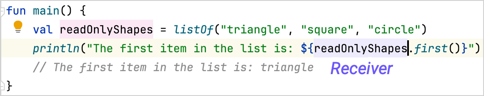

[//]: # (title: Extension functions)

<no-index/>


この章では、コードをより簡潔で読みやすくするKotlinの特別な関数について学びます。
効率的なデザインパターンを活用して、プロジェクトを次のレベルへと引き上げるために、それらがどのように役立つかをご覧ください。

## 拡張関数

ソフトウェア開発では、元のソースコードを変更せずにプログラムの動作を修正する必要がよくあります。
たとえば、サードパーティのライブラリにあるクラスに追加の機能を追加したい場合などがあります。

これを行うには、クラスを拡張するための _拡張関数_ を追加します。
拡張関数は、クラスのメンバ関数を呼び出すのと同じように、ピリオド `.` を使って呼び出します。

拡張関数の完全な構文を紹介する前に、**レシーバー**とは何かを理解しておく必要があります。
レシーバー(Receiver)とは、その関数が呼び出される対象のことです。言い換えれば、レシーバーとは、情報が共有される場所、あるいは相手のことなのです。

{width="500"}

この例では、`main()`関数が[`.first()`](https://kotlinlang.org/api/core/kotlin-stdlib/kotlin.collections/first.html)関数を呼び出し、リストの最初の要素を返しています。
`.first()` 関数は `readOnlyShapes` 変数に対して呼び出されるため、`readOnlyShapes` 変数がレシーバーとなります。

拡張関数を作成するには、拡張したいクラスの名前の後に `.` を付け、その後に関数名を記述します。
関数の宣言の残りの部分（パラメータや戻り値の型など）を続けて記述してください。

For example:

```kotlin
fun String.bold(): String = "<b>$this</b>"

fun main() {
    // "hello" is the receiver
    println("hello".bold())
    // <b>hello</b>
}
```
{kotlin-runnable="true" kotlin-min-compiler-version="1.3" id="kotlin-tour-extension-function"}

この例では：

* `String` は派生クラスです。
* `bold` は拡張関数の名前です。
* `.bold()` 拡張関数の戻り値の型は `String` です。
* `「hello」`（`String`のインスタンス）を受信者として指定します。
* レシーバーには、[キーワード](keyword-reference.md) `this` を使用して、本体内部からアクセスします。
* 文字列テンプレート（`$`）は、`this`の値にアクセスするために使用されます。
* `.bold()` 拡張関数は文字列を受け取り、それを太字のテキストとして `<b>` HTML 要素内に返します。

## Extension-oriented design
## 拡張性を重視した設計

拡張関数はどこでも定義できるため、拡張性を重視した設計を行うことが可能になります。
これらの設計では、中核となる機能と、有用ではあるものの必須ではない機能を分離することで、コードの可読性と保守性を高めています。

その好例が、ネットワークリクエストの実行を支援するKtorライブラリの[`HttpClient`](https://api.ktor.io/ktor-client-core/io.ktor.client/-http-client/index.html)クラスです。
その機能の中核となるのは、HTTPリクエストに必要なすべての情報を受け取る単一の関数 `request()` です：

```kotlin
class HttpClient {
    fun request(method: String, url: String, headers: Map<String, String>): HttpResponse {
        // Network code
    }
}
```
{validate="false"}

実際には、最もよく使われるHTTPリクエストはGETまたはPOSTリクエストです。ライブラリが、こうした一般的なユースケースに対してより短い名前を提供するのは理にかなっています。
ただし、これらには新しいネットワークコードを記述する必要はなく、特定のリクエスト呼び出しを行うだけで済みます。
つまり、これらは個別の `.get()` および `.post()` 拡張関数として定義するのに最適な候補であると言えます：

```kotlin
fun HttpClient.get(url: String): HttpResponse = request("GET", url, emptyMap())
fun HttpClient.post(url: String): HttpResponse = request("POST", url, emptyMap())
```
{validate="false"}

これらの `.get()` および `.post()` 関数は、`HttpClient` クラスを拡張しています。これらは、`HttpClient` クラスのインスタンスをレシーバーとして呼び出されるため、`HttpClient` クラスの `request()` 関数を直接使用することができます。
これらの拡張関数を使用すると、適切なHTTPメソッドを指定して`request()`関数を呼び出すことができ、コードが簡潔になり、理解しやすくなります：

```kotlin
class HttpClient {
    fun request(method: String, url: String, headers: Map<String, String>): HttpResponse {
        println("Requesting $method to $url with headers: $headers")
        return HttpResponse("Response from $url")
    }
}

fun HttpClient.get(url: String): HttpResponse = request("GET", url, emptyMap())

fun main() {
    val client = HttpClient()

    // request() を直接使用して GET リクエストを送信する
    val getResponseWithMember = client.request("GET", "https://example.com", emptyMap())

    // get() 拡張関数を使用して GET リクエストを送信する
    // クライアントインスタンスが受信側です
    val getResponseWithExtension = client.get("https://example.com")
}
```
{validate="false"}

この拡張性重視のアプローチは、Kotlinの[標準ライブラリ](https://kotlinlang.org/api/latest/jvm/stdlib/)やその他のライブラリで広く採用されています。
たとえば、`String` クラスには、文字列の操作に役立つ多くの [拡張関数](https://kotlinlang.org/api/latest/jvm/stdlib/kotlin/-string/#extension-functions) が用意されています。

For more information about extension functions, see [Extensions](extensions.md).

## 演習 {completion-point="true"}


### 課題 1 {initial-collapse-state="collapsed" collapsible="true" id="extension-functions-exercise-1"}

整数を受け取り、それが正の値であるかどうかを調べる `isPositive` という拡張関数を作成してください。

|---|---|
```kotlin
fun Int.// Write your code here

fun main() {
    println(1.isPositive())
    // true
}
```
{validate="false" kotlin-runnable="true" kotlin-min-compiler-version="1.3" id="kotlin-tour-extension-functions-exercise-1"}

|---|---|
```kotlin
fun Int.isPositive(): Boolean = this > 0

fun main() {
    println(1.isPositive())
    // true
}
```
{initial-collapse-state="collapsed" collapsible="true" collapsed-title="Example solution" id="kotlin-tour-extension-functions-solution-1"}

### 課題 2 {initial-collapse-state="collapsed" collapsible="true" id="extension-functions-exercise-2"}

文字列を受け取り、小文字に変換した文字列を返す `toLowercaseString` という拡張関数を作成してください。

<deflist collapsible="true">
    <def title="Hint">
        <a href="https://kotlinlang.org/api/latest/jvm/stdlib/kotlin.text/lowercase.html"> <code>.lowercase()</code>
        </a> 関数を、<code>String</code> 型に対して使用します。
    </def>
</deflist>

|---|---|
```kotlin
fun // Write your code here

fun main() {
    println("Hello World!".toLowercaseString())
    // hello world!
}
```
{validate="false" kotlin-runnable="true" kotlin-min-compiler-version="1.3" id="kotlin-tour-extension-functions-exercise-2"}

|---|---|
```kotlin
fun String.toLowercaseString(): String = this.lowercase()

fun main() {
    println("Hello World!".toLowercaseString())
    // hello world!
}
```
{initial-collapse-state="collapsed" collapsible="true" collapsed-title="Example solution" id="kotlin-tour-extension-functions-solution-2"}

<seealso></seealso>

<list columns="2" id="tour-nav">
  <li>
    <a as="button" href="kotlin-tour-null-safety_jp.md" mode="outline" icon="arrow-left" icon-position="left">Previous step</a>
  </li>
  <li>
    <a as="button" href="kotlin-tour-intermediate-scope-functions_jp.md" mode="classic" icon="arrow-right" icon-position="right">Next step</a>
  </li>
</list>
