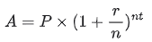

[//]: # (title: Libraries and APIs)

<no-index/>


Kotlinを最大限に活用するには、既存のライブラリやAPIを活用し、一から作り直す時間を減らして、コーディングに費やす時間を増やしましょう。

ライブラリは、一般的なタスクを簡略化する再利用可能なコードを提供します。
ライブラリ内には、関連するクラス、関数、ユーティリティをまとめたパッケージやオブジェクトが存在します。
ライブラリは、開発者が自身のコード内で利用できる一連の関数、クラス、またはプロパティとして、API（アプリケーション・プログラミング・インターフェース）を提供します。

<!-- [Kotlin libraries and APIs](kotlin-library-diagram.svg){width=600} -->

<div align="center">
      
</div>

Kotlinで何ができるのか、一緒に探ってみましょう。

## The standard library
## 標準ライブラリ

Kotlinには、コードを簡潔かつ表現力豊かにするための基本的な型、関数、コレクション、ユーティリティを提供する標準ライブラリが用意されています。
標準ライブラリの大部分（[`kotlin` パッケージ](https://kotlinlang.org/api/core/kotlin-stdlib/kotlin/)に含まれるすべてのもの）は、明示的にインポートする必要なく、どの Kotlin ファイルでもすぐに利用できます：

```kotlin
fun main() {
    val text = "emosewa si niltoK"
    
   // Use the reversed() function from the standard library
    val reversedText = text.reversed()

    // Use the print() function from the standard library
    print(reversedText)
    // Kotlin is awesome
}
```
{kotlin-runnable="true" id="kotlin-tour-libraries-stdlib"}

ただし、標準ライブラリの一部については、コード内で使用するには、あらかじめインポートを行う必要があります。
たとえば、標準ライブラリの時間測定機能を使用したい場合は、[`kotlin.time` パッケージ](https://kotlinlang.org/api/core/kotlin-stdlib/kotlin.time/)をインポートする必要があります。

ファイルの先頭に、`import` キーワードと、それに続く必要なパッケージ名を追加してください：

```kotlin
import kotlin.time.*
```

アスタリスク `*` はワイルドカードインポートであり、Kotlin にそのパッケージ内のすべてをインポートするよう指示します。
コンパニオンオブジェクトでは、アスタリスク `*` を使用することはできません。その代わりに、使用したいコンパニオンオブジェクトのメンバを明示的に宣言する必要があります。

For example:

```kotlin
import kotlin.time.Duration
import kotlin.time.Duration.Companion.hours
import kotlin.time.Duration.Companion.minutes

fun main() {
    val thirtyMinutes: Duration = 30.minutes
    val halfHour: Duration = 0.5.hours
    println(thirtyMinutes == halfHour)
    // true
}
```
{kotlin-runnable="true" id="kotlin-tour-libraries-time"}

この例では：

* `Duration` クラスと、そのコンパニオンオブジェクトから `hours` および `minutes` の拡張プロパティをインポートします。
* `minutes` プロパティを使用して、`30` を 30 分の `Duration` に変換します。
* `hours` プロパティを使用して、`0.5` を 30 分の `Duration` に変換します。
* 2つの期間が等しいかどうかを確認し、結果を出力します。

### Search before you build
### ビルドする前に検索する

独自のコードを書くことに決める前に、標準ライブラリを確認して、探しているものがすでに存在しないか確認してください。
以下は、標準ライブラリがすでに多くのクラス、関数、プロパティを提供している分野の一覧です：

* [Collections](https://kotlinlang.org/api/core/kotlin-stdlib/kotlin.collections/)
* [Sequences](https://kotlinlang.org/api/core/kotlin-stdlib/kotlin.sequences/)
* [String 操作](https://kotlinlang.org/api/core/kotlin-stdlib/kotlin.text/)
* [Time マネージメント](https://kotlinlang.org/api/core/kotlin-stdlib/kotlin.time/)

標準ライブラリには他にどのようなものが含まれているかについて詳しく知りたい場合は、その[APIリファレンス](https://kotlinlang.org/api/core/kotlin-stdlib/)をご覧ください。

## Kotlin libraries
## Kotlinライブラリ

標準ライブラリは多くの一般的なユースケースを網羅していますが、対応していないものもあります。
幸いなことに、Kotlinチームやコミュニティの他のメンバーによって、標準ライブラリを補完する幅広いライブラリが開発されています。
例えば、
[`kotlinx-datetime`](https://kotlinlang.org/api/kotlinx-datetime/) を使用すると、さまざまなプラットフォーム間で時刻を管理しやすくなります。

我々の[検索プラットフォーム](https://klibs.io/)で、役立つライブラリを見つけることができます。
これらを使用するには、依存関係やプラグインを追加するなど、追加の手順が必要になります。
各ライブラリには、Kotlinプロジェクトに組み込む方法に関する手順が記載されたGitHubリポジトリがあります。

ライブラリを追加すれば、そのライブラリ内のどのパッケージでもインポートできるようになります。
以下は、`kotlinx-datetime` パッケージをインポートしてニューヨークの現在時刻を取得する方法の例です。

```kotlin
import kotlinx.datetime.*

fun main() {
    val now = Clock.System.now() // Get current instant
    println("Current instant: $now")

    val zone = TimeZone.of("America/New_York")
    val localDateTime = now.toLocalDateTime(zone)
    println("Local date-time in NY: $localDateTime")
}
```
{kotlin-runnable="true" id="kotlin-tour-libraries-datetime"}

This example:

* `kotlinx.datetime` パッケージをインポートします。
* `Clock.System.now()` 関数を使用して、現在の時刻を含む `Instant` クラスのインスタンスを作成し、その結果を `now` 変数に代入します。
* 現在の時刻を表示します。
* `TimeZone.of()` 関数を使用してニューヨークのタイムゾーンを取得し、その結果を `zone` 変数に代入します。
* 現在の時刻を含むインスタンスに対して、引数としてニューヨークのタイムゾーンを指定して、`.toLocalDateTime()` 関数を呼び出します。
* 結果を `localDateTime` 変数に代入します。
* ニューヨークのタイムゾーンに合わせて調整された時刻を表示します。

> この例で使用されている関数やクラスについてさらに詳しく知りたい場合は、[APIリファレンス](https://kotlinlang.org/api/kotlinx-datetime/kotlinx-datetime/kotlinx.datetime/)を参照してください。
>
{style="tip"}

## Opt in to APIs
## APIの利用登録

ライブラリの作成者は、コード内で特定のAPIを使用する前にオプトイン(事前同意・事前の利用登録)が必要であることを明記する場合があります。
通常、APIがまだ開発中で、将来変更される可能性がある場合に、このような対応をとります。
オプトインしない場合、次のような警告やエラーが表示されます：

```text
この宣言にはオプトインが必要です。使用時には「@...」または「@OptIn(...)」を付記してください。
```

オプトインするには、`@OptIn` の後に、API を分類するクラス名を括弧で囲み、その後に 2 つのコロン `::` と `class` を続けて記述します。

たとえば、標準ライブラリの `uintArrayOf()` 関数は、
[API リファレンス](https://kotlinlang.org/api/core/kotlin-stdlib/kotlin.collections/to-u-int-array.html) に示されているように、`@ExperimentalUnsignedTypes` の対象となります：

```kotlin
@ExperimentalUnsignedTypes
inline fun uintArrayOf(vararg elements: UInt): UIntArray
```

コード内のオプトインは、次のような形になっています：

```kotlin
@OptIn(ExperimentalUnsignedTypes::class)
```

以下は、`uintArrayOf()` 関数を使用して符号なし整数の配列を作成し、その要素の 1 つを変更する例です。

```kotlin
@OptIn(ExperimentalUnsignedTypes::class)
fun main() {
    // 符号なし整数の配列を作成する
    val unsignedArray: UIntArray = uintArrayOf(1u, 2u, 3u, 4u, 5u)

    // 要素を変更する
    unsignedArray[2] = 42u
    println("Updated array: ${unsignedArray.joinToString()}")
    // Updated array: 1, 2, 42, 4, 5
}
```
{kotlin-runnable="true" id="kotlin-tour-libraries-apis"}

これが参加する最も簡単な方法ですが、他にも方法があります。
詳細については、[オプトイン要件](opt-in-requirements.md)をご覧ください。

## 演習 {completion-point="true"}

### 課題 1 {initial-collapse-state="collapsed" collapsible="true" id="libraries-exercise-1"}

あなたは、ユーザーが投資の将来価値を計算できるようにする金融アプリケーションを開発しています。
複利を計算する式は次のとおりです：

<!-- 
    <math>A = P \times (1 + \displaystyle\frac{r}{n})^{nt}</math>
-->

<div align="center">
      
</div>

ここで:

* `A` は、利息を加えた後の総額（元本＋利息）です。
* `P` は元本（初期投資額）です。
* `r` は年利（小数表記）です。
* `n` は、1年あたりの複利計算の回数です。
* `t` は、資金が投資される期間（年単位）です。

コードを次のように更新してください：

1. [`kotlin.math` パッケージ](https://kotlinlang.org/api/core/kotlin-stdlib/kotlin.math/) から必要な関数をインポートします。
2. `calculateCompoundInterest()` 関数に、複利を適用した後の最終金額を計算する本体を追加してください。

|--|--|

```kotlin
// Write your code here

fun calculateCompoundInterest(P: Double, r: Double, n: Int, t: Int): Double {
    // Write your code here
}

fun main() {
    val principal = 1000.0
    val rate = 0.05
    val timesCompounded = 4
    val years = 5
    val amount = calculateCompoundInterest(principal, rate, timesCompounded, years)
    println("The accumulated amount is: $amount")
    // The accumulated amount is: 1282.0372317085844
}

```
{validate="false" kotlin-runnable="true" kotlin-min-compiler-version="1.3" id="kotlin-tour-libraries-exercise-1"}

|---|---|
```kotlin
import kotlin.math.*

fun calculateCompoundInterest(P: Double, r: Double, n: Int, t: Int): Double {
    return P * (1 + r / n).pow(n * t)
}

fun main() {
    val principal = 1000.0
    val rate = 0.05
    val timesCompounded = 4
    val years = 5
    val amount = calculateCompoundInterest(principal, rate, timesCompounded, years)
    println("The accumulated amount is: $amount")
    // The accumulated amount is: 1282.0372317085844
}
```
{initial-collapse-state="collapsed" collapsible="true" collapsed-title="Example solution" id="kotlin-tour-libraries-solution-1"}

### 課題 2 {initial-collapse-state="collapsed" collapsible="true" id="libraries-exercise-2"}

プログラム内で複数のデータ処理タスクを実行するのにかかる時間を測定したいと考えています。
[`kotlin.time`](https://kotlinlang.org/api/core/kotlin-stdlib/kotlin.time/) パッケージから正しいインポート文と関数を追加するようにコードを更新してください：

|---|---|

```kotlin
// Write your code here

fun main() {
    val timeTaken = /* Write your code here */ {
        // データ処理をシミュレートする
        val data = List(1000) { it * 2 }
        val filteredData = data.filter { it % 3 == 0 }

        // フィルタ処理されたデータの処理をシミュレートする
        val processedData = filteredData.map { it / 2 }
        println("Processed data")
    }

    println("Time taken: $timeTaken") // e.g. 16 ms
}
```
{validate="false" kotlin-runnable="true" kotlin-min-compiler-version="1.3" id="kotlin-tour-libraries-exercise-2"}

|---|---|
```kotlin
import kotlin.time.measureTime

fun main() {
    val timeTaken = measureTime {
        // Simulate some data processing
        val data = List(1000) { it * 2 }
        val filteredData = data.filter { it % 3 == 0 }

        // Simulate processing the filtered data
        val processedData = filteredData.map { it / 2 }
        println("Processed data")
    }

    println("Time taken: $timeTaken") // e.g. 16 ms
}
```
{initial-collapse-state="collapsed" collapsible="true" collapsed-title="Example solution" id="kotlin-tour-libraries-solution-2"}

### 課題 3 {initial-collapse-state="collapsed" collapsible="true" id="properties-exercise-3"}

最新のKotlinリリースでは、標準ライブラリに新機能が追加されました。
試してみたいのですが、オプトインが必要です。この機能は [`@ExperimentalStdlibApi`](https://kotlinlang.org/api/core/kotlin-stdlib/kotlin/-experimental-stdlib-api/) に含まれています。
コード内でのオプトインはどのように記述すべきでしょうか？

|---|---|
```kotlin
@OptIn(ExperimentalStdlibApi::class)
```
{initial-collapse-state="collapsed" collapsible="true" collapsed-title="Example solution" id="kotlin-tour-libraries-solution-3"}

## 次は？

おめでとうございます！
中級ツアーをクリアしました！
ご利用体験について、[ご意見をお寄せ](https://surveys.hotjar.com/bf4ce865-99ce-4fc1-b107-e9b16bc31592)いただけませんか？

次のステップとして、人気のKotlinアプリケーションに関するチュートリアルをご覧ください：

* [Spring BootとKotlinを使ってバックエンドアプリケーションを作成する](jvm-create-project-with-spring-boot.md)
* AndroidおよびiOS向けのクロスプラットフォームアプリケーションをゼロから作成し、:
    * [UIをネイティブのままに保ちつつ、ビジネスロジックを共有する](https://kotlinlang.org/docs/multiplatform/multiplatform-create-first-app.html)
    * [ビジネスロジックとUIを共有する](https://kotlinlang.org/docs/multiplatform/compose-multiplatform-create-first-app.html)

<seealso></seealso>

<list id="tour-nav">
  <li>
    <a as="button" href="kotlin-tour-intermediate-null-safety_jp.md" mode="outline" icon="arrow-left" icon-position="left">Previous step</a>
  </li>
</list>
